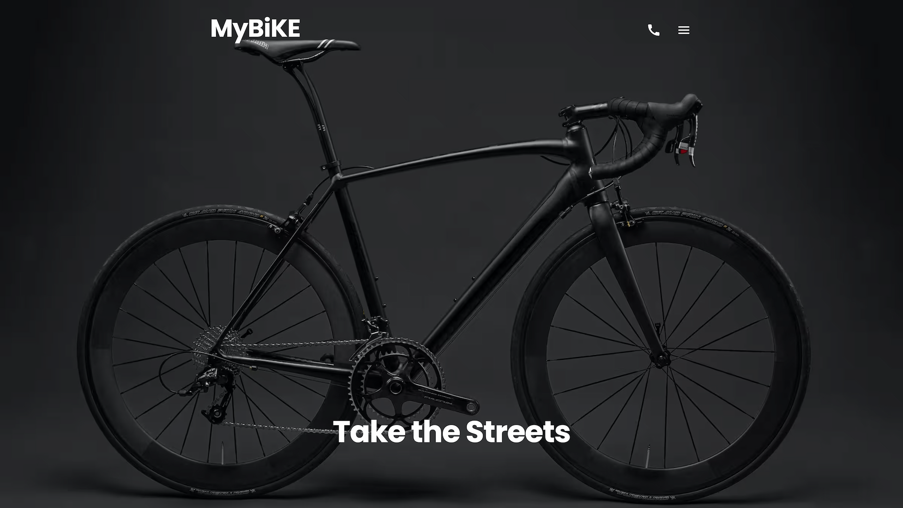

# MyBike Landing Page

> Electric bikes for urban riders — fast, GPS-enabled, and built for the city.

**[Live Demo →](https://my-bike-landing-page.netlify.app)**



---

## Features

- **Responsive** — mobile-first layout with dedicated breakpoints for tablet and desktop
- **Accessible** — keyboard navigation, focus management, semantic HTML, and ARIA attributes throughout
- **Animated** — scroll-triggered entrance animations via AOS
- **Optimized** — AVIF images, minified assets, and long-term cache headers configured on Netlify

---

## Sections

| Section | Description |
|---------|-------------|
| Header | Full-bleed hero with a call-to-action |
| About us | Brand tagline with scroll animations |
| Compare Bikes | Three-model product grid |
| The Details | Feature deep-dives with paired imagery |
| Contact us | Form + contact info |

---

## Tech stack

| Tool | Purpose |
|------|---------|
| [Vite 8](https://vitejs.dev) | Build tool & dev server |
| Vanilla JS (ES modules) | Interactivity — menu, form, AOS init |
| [SCSS + BEM](https://sass-lang.com) | Styles, enforced by Stylelint |
| [AOS](https://michalsnik.github.io/aos/) | Animate On Scroll library |
| [focus-trap](https://github.com/focus-trap/focus-trap) | Focus management for the overlay menu |
| [Netlify](https://netlify.com) | Hosting + cache-control headers |

---

## Responsiveness

The layout is mobile-first and adapts across three breakpoints.

The product grid, detail sections, and contact layout all reflow from single-column to multi-column using SCSS mixins.

---

## Accessibility

- **Keyboard navigation** — the overlay menu traps focus with `focus-trap` so Tab never escapes to hidden content
- **`inert` attribute** — the menu is marked `inert` when closed, hiding it from assistive technologies entirely
- **ARIA** — `aria-expanded`, `aria-controls`, and `aria-hidden` keep screen readers in sync with UI state
- **Visually hidden labels** — form inputs have off-screen `<label>` elements so they're announced by screen readers without cluttering the visual design
- **Semantic HTML** — `<header>`, `<nav>`, `<main>`, `<footer>`, `<article>`, `<section>`, `<address>`, `<dl>` used throughout
- **Alt text** — every `` has a descriptive `alt` attribute
- **`lang` attribute** — `<html lang="en">` declared for correct speech synthesis

---

## Getting started

```bash
npm install
npm run dev      # start dev server at http://localhost:5173
npm run build    # production build → dist/
npm run preview  # preview the production build locally
npm run fix      # auto-fix JS (ESLint), SCSS (Stylelint), and formatting (Prettier)
npm run lint:html  # lint index.html with HTMLHint
```

---

## License

[MIT](LICENSE) © 2026 Artem
